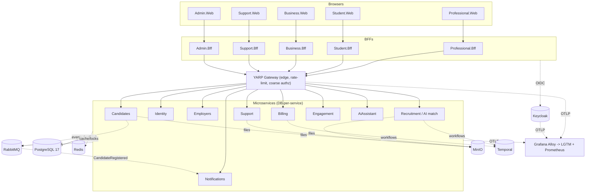

# C4 Level 2 — Container

> **Status:** Draft · **Owner:** Platform Architecture · **Last updated:** 2026-05-30 · **Related ADRs:** ADR-0001..0008

Reference vertical slice implemented: **Candidates** (Domain/Application/Infrastructure/Api + tests),
publishing `CandidateRegistered` via the **transactional outbox** (ADR-0007) to the **Notifications**
worker — the first end-to-end publish→consume loop. Shared contracts live in `*.Contracts` (ADR-0008).

Second slice implemented: **Recruitment** — same Clean Architecture layering, serving live analytics
(funnel, hires trend, matching, top cities) over a decade of seeded requests/applications and publishing
`RecruitmentRequestPosted` via the outbox. Its domain tables are pre-existing/seeded and mapped with
`ExcludeFromMigrations`, so only the MassTransit outbox tables are migration-managed. The Business portal's
hiring-funnel and hires-per-year charts are wired live to `GET /api/recruitment/stats` through the gateway.
