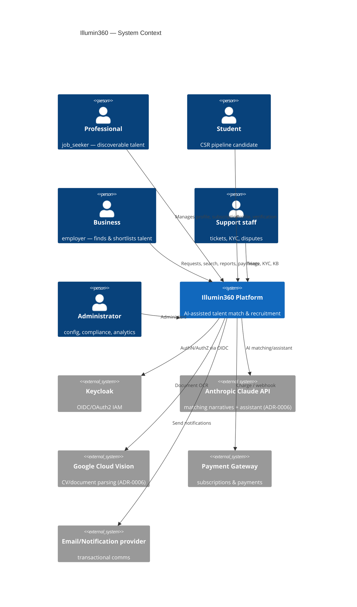

# C4 Level 1 — System Context

> **Status:** Draft · **Owner:** Platform Architecture · **Last updated:** 2026-05-29 · **Related ADRs:** ADR-0001..0006

```mermaid
C4Context
    title Illumin360 — System Context
    Person(prof, "Professional", "job_seeker — discoverable talent")
    Person(student, "Student", "CSR pipeline candidate")
    Person(biz, "Business", "employer — finds & shortlists talent")
    Person(support, "Support staff", "tickets, KYC, disputes")
    Person(admin, "Administrator", "config, compliance, analytics")

    System(illumin, "Illumin360 Platform", "AI-assisted talent match & recruitment")

    System_Ext(keycloak, "Keycloak", "OIDC/OAuth2 IAM")
    System_Ext(claude, "Anthropic Claude API", "matching narratives + assistant (ADR-0006)")
    System_Ext(vision, "Google Cloud Vision", "CV/document parsing (ADR-0006)")
    System_Ext(pay, "Payment Gateway", "subscriptions & payments")
    System_Ext(mail, "Email/Notification provider", "transactional comms")

    Rel(prof, illumin, "Manages profile, subscription")
    Rel(student, illumin, "Profile, verification")
    Rel(biz, illumin, "Requests, search, reports, payments")
    Rel(support, illumin, "Triage, KYC, KB")
    Rel(admin, illumin, "Administers")
    Rel(illumin, keycloak, "AuthN/AuthZ via OIDC")
    Rel(illumin, claude, "AI matching/assistant")
    Rel(illumin, vision, "Document OCR")
    Rel(illumin, pay, "Charge / webhook")
    Rel(illumin, mail, "Send notifications")
```
